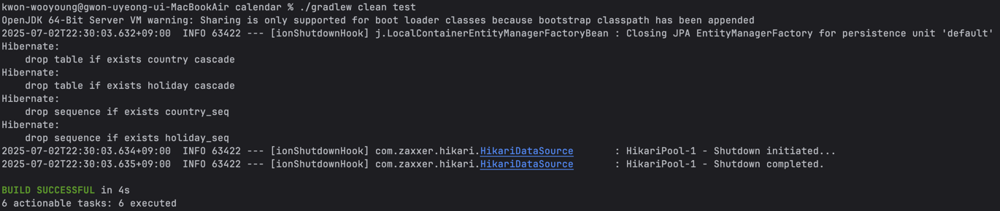
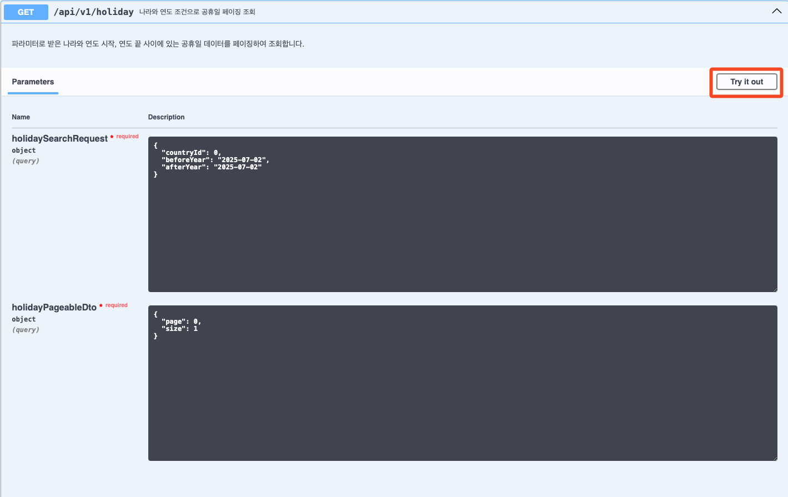
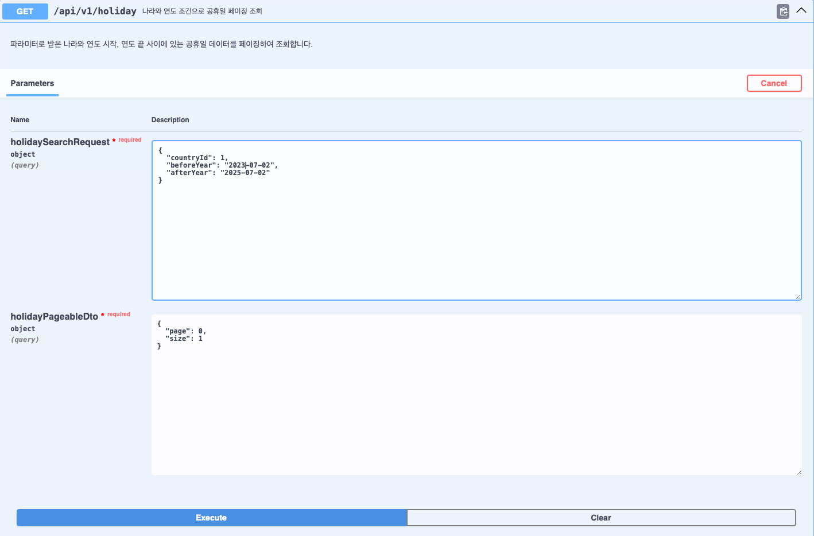

# 플랜잇스퀘어 백엔드 개발자 채용 과제

## 🗓️ 전세계 공휴일 데이터 저장, 조회, 관리 시스템

---

### 📋 목차

1. [사용 기술 스택](#1-기술--스택) 
2. [빌드 & 실행 방법](#2-빌드--실행-방법)
2.  [설계한 REST API 명세 요약](#3-설계한-rest-api-명세-요약)
3.  [`./gradlew clean test` 성공 스크린샷](#4-gradlew-clean-test-성공-스크린샷)
4.  [Swagger UI 또는 OpenAPI JSON 노출 확인 방법](#5-swagger-ui-또는-openapi-json-노출-확인-방법)

---
### 1. 기술 스택
본 프로젝트는 다음과 같은 기술 스택을 사용하여 개발되었습니다.
- **Java**: 21
- **Spring Boot**: 3.4.7
- **JPA**: Hibernate
- **Database**: H2

### 1. 빌드 & 실행 방법

본 프로젝트는 Gradle 기반의 Spring Boot 애플리케이션입니다.

**🚀 빌드 및 실행 단계:**

1.  **프로젝트 클론**
    ```bash
    git clone https://github.com/WooyoungKwon/calendar.git
    ```

2.  **프로젝트 빌드:**
    ```bash
    ./gradlew clean build
    ```

3.  **애플리케이션 실행:**
    ```bash
    ./gradlew bootRun
    ```

    ---
    **💡 참고:**
    * 애플리케이션은 기본적으로 `8080` 포트에서 실행됩니다.
    * H2 Console은 `http://localhost:8080/h2-console` 에서 접속 가능합니다.
    * JDBC URL: `jdbc:h2:mem:test`
    ---

### 2. 설계한 REST API 명세 요약

본 시스템에서 제공하는 주요 REST API 엔드포인트에 대한 명세입니다.

---

### 2.1. 국가 정보 조회 API
#### 2.1.1 국가 코드로 정보 조회
* **설명:** 시스템에 저장된 국가 정보를 페이징하여 조회합니다.
* **엔드포인트:** `GET /api/v1/country/code`
* **파라미터 (Query Parameters):**
    * `countryCode` (필수): 조회할 국가의 코드 값 (예: "KR")

* **요청 예시:**
    ```
    GET http://localhost:8080/api/v1/country/code?countryCode=kr
    ```

* **응답 예시 (성공: 200 OK):**
```json
{
  "status": 200,
  "code": "2010",
  "message": "국가 정보 조회 성공",
  "data": {
    "countryId": 64,
    "name": "South Korea",
    "countryCode": "KR"
  },
  "timestamp": "2025-07-02T22:43:56.794892"
}
```
#### 2.1.2 국가 목록 조회
* **설명:** 시스템에 저장된 국가 정보를 페이징하여 조회합니다.
* **엔드포인트:** `GET /api/v1/country/list`
* **파라미터 (Query Parameters):**
    * `page` (선택): 페이지 번호 (기본값: 0)
    * `size` (선택): 페이지당 항목 수 (기본값: 10)

* **요청 예시:**
    ```
    GET http://localhost:8080/api/v1/country/list?page=0&size=10
    ```

* **응답 예시 (성공: 200 OK):**
```json
{
  "status": 200,
  "code": "2013",
  "message": "국가 목록 조회 성공",
  "data": {
    "currentCount": 10,
    "totalCount": 117,
    "totalPageCount": 12,
    "countryList": [
      {
        "countryId": 1,
        "name": "Andorra",
        "countryCode": "AD"
      },
      {
        "countryId": 2,
        "name": "Albania",
        "countryCode": "AL"
      },
      {
        "countryId": 3,
        "name": "Armenia",
        "countryCode": "AM"
      },
      ...
  "timestamp": "2025-07-02T21:31:15.160568"
}
```

### 2.2. 공휴일 조회 관련 API
#### 2.2.1. 국가별 공휴일 조회
* **설명:** 특정 국가의 공휴일 데이터를 페이징 형태로 조회합니다.
* **엔드포인트:** `GET /api/v1/country`
* **파라미터 (Query Parameters):**
    * `countryId` (필수): 조회할 국가의 id 값
    * `page` (선택): 페이지 번호 (기본값: 0)
    * `size` (선택): 페이지당 항목 수 (기본값: 10)

* **요청 예시:**
    ```
    GET http://localhost:8080/api/v1/country/country?countryId=1&page=0&size=1
    ```

* **응답 예시 (성공: 200 OK):**
```json
{
  "status": 200,
  "code": "2010",
  "message": "공휴일 조회 성공",
  "data": {
    "condition": "국가: Andorra",
    "totalCount": 84,
    "totalPageCount": 84,
    "currentCount": 1,
    "holidays": [
      {
        "id": 1,
        "date": "2020-01-01",
        "localName": "Any nou",
        "name": "New Year's Day",
        "fixed": false,
        "global": true,
        "counties": null,
        "launchYear": null,
        "types": [
          "Public"
        ]
      }
    ]
  },
  "timestamp": "2025-07-02T22:10:24.72516"
}
```

#### 2.2.2. 연도별 공휴일 조회
* **설명:** 특정 연도의 공휴일 데이터를 페이징 형태로 조회합니다.
* **엔드포인트:** `GET /api/v1/holiday/year`
* **파라미터 (Query Parameters):**
    * `year` (필수): 조회할 연도 값
    * `page` (선택): 페이지 번호 (기본값: 0)
    * `size` (선택): 페이지당 항목 수 (기본값: 10)

* **요청 예시:**
    ```
    GET http://localhost:8080/api/v1/holiday/year?year=2022&page=0&size=1
    ```

* **응답 예시 (성공: 200 OK):**
```json
{
  "status": 200,
  "code": "2010",
  "message": "공휴일 조회 성공",
  "data": {
    "condition": "연도: 2022년",
    "totalCount": 1648,
    "totalPageCount": 1648,
    "currentCount": 1,
    "holidays": [
      {
        "id": 306,
        "date": "2022-01-01",
        "localName": "Any nou",
        "name": "New Year's Day",
        "fixed": false,
        "global": true,
        "counties": null,
        "launchYear": null,
        "types": [
          "Public"
        ],
        "countryName": "Andorra"
      }
    ]
  },
  "timestamp": "2025-07-02T22:12:01.701203"
}
```

#### 2.2.3. 나라 + 연도 공휴일 조회
* **설명:** 특정 연도의 공휴일 데이터를 페이징 형태로 조회합니다.
* **엔드포인트:** `GET /api/v1/holiday`
* **파라미터 (Query Parameters):**
    * `countryId` (필수): 조회할 국가의 id 값
    * `year` (필수): 조회할 연도 값
    * `page` (선택): 페이지 번호 (기본값: 0)
    * `size` (선택): 페이지당 항목 수 (기본값: 10)

* **요청 예시:**
    ```
    GET http://localhost:8080/api/v1/holiday?countryId=1&beforeYear=2022-07-02&afterYear=2025-07-02&page=0&size=1
    ```

* **응답 예시 (성공: 200 OK):**
```json
{
  "status": 200,
  "code": "2010",
  "message": "공휴일 조회 성공",
  "data": {
    "condition": "나라: Andorra, 날짜 범위: 2022-07-02 ~ 2025-07-02",
    "totalCount": 42,
    "totalPageCount": 42,
    "currentCount": 1,
    "holidays": [
      {
        "id": 304,
        "date": "2022-08-15",
        "localName": "Assumpció",
        "name": "Assumption Day",
        "fixed": false,
        "global": true,
        "counties": null,
        "launchYear": null,
        "types": [
          "Public"
        ]
      }
    ]
  },
  "timestamp": "2025-07-02T22:19:06.477819"
}
```
---

### 2.3. 동기화 관련 API
#### 2.3.1. 국가별 공휴일 동기화
* **설명:** 특정 국가의 공휴일 데이터를 외부 API에서 가져와 모든 연도를 재동기화합니다
* **엔드포인트:** `POST /api/v1/country/synchronize/country`
* **파라미터 (Query Parameters):**
    * `countryId` (필수): 동기화할 국가의 id 값

* **요청 예시:**
    ```
    POST http://localhost:8080/api/v1/country/synchronize/country?countryId=1
    ```

* **응답 예시 (성공: 200 OK):**
```json
{
  "status": 200,
  "code": "2012",
  "message": "공휴일 데이터 동기화 성공",
  "data": {
    "totalAddCount": 14,
    "totalUpdateCount": 70,
    "totalDeleteCount": 0
  },
  "timestamp": "2025-07-02T21:38:35.177574"
}
```

#### 2.3.2. 연도별 공휴일 동기화
* **설명:** 특정 국가의 공휴일 데이터를 외부 API에서 가져와 모든 연도를 재동기화합니다
* **엔드포인트:** `POST /api/v1/country/synchronize/year`
* **파라미터 (Query Parameters):**
    * `year` (필수): 동기화할 연도 (YYYY 형식)

* **요청 예시:**
    ```
    POST localhost:8080/api/v1/holiday/synchronize/year?year=2020
    ```

* **응답 예시 (성공: 200 OK):**
```json
{
  "status": 200,
  "code": "2012",
  "message": "공휴일 데이터 동기화 성공",
  "data": {
    "totalAddCount": 0,
    "totalUpdateCount": 1639,
    "totalDeleteCount": 0
  },
  "timestamp": "2025-07-02T21:45:40.791346"
}
```

#### 2.3.3. 국가 + 연도 공휴일 동기화
* **설명:** 특정 국가의 특정 연도 공휴일 데이터를 외부 API에서 가져와 모든 연도를 재동기화합니다
* **엔드포인트:** `POST /api/v1/country/synchronize/year`
* **파라미터 (Query Parameters):**
    * `countryId` (필수): 동기화할 국가의 id 값
    * `year` (필수): 동기화할 연도 (YYYY 형식)

* **요청 예시:**
    ```
    POST http://localhost:8080/api/v1/holiday/synchronize?countryId=1&year=2022
    ```

* **응답 예시 (성공: 200 OK):**
```json
{
  "status": 200,
  "code": "2012",
  "message": "공휴일 데이터 동기화 성공",
  "data": {
    "totalAddCount": 0,
    "totalUpdateCount": 14,
    "totalDeleteCount": 0
  },
  "timestamp": "2025-07-02T22:02:36.22882"
}
```
---
### 2.4. 삭제 관련 API
#### 2.4.1. 국가별 공휴일 삭제
* **설명:** 특정 국가의 공휴일 데이터를 전부 삭제합니다.
* **엔드포인트:** `DELETE /api/v1/country/holiday`
* **파라미터 (Query Parameters):**
      * `countryId` (필수): 공휴일을 삭제할 국가의 id 값

* **요청 예시:**
    ```
    DELETE http://localhost:8080/api/v1/country/holiday?countryId=1
    ```

* **응답 예시 (성공: 200 OK):**
```json
{
  "status": 200,
  "code": "2015",
  "message": "공휴일 데이터가 삭제되었습니다.",
  "data": null,
  "timestamp": "2025-07-02T22:22:24.202562"
}
```

#### 2.4.2. 연도별 공휴일 삭제
* **설명:** 특정 국가의 공휴일 데이터를 전부 삭제합니다.
* **엔드포인트:** `DELETE /api/v1/holiday/year`
* **파라미터 (Query Parameters):**
  * `year` (필수): 공휴일을 삭제할 연도 (YYYY 형식)

* **요청 예시:**
    ```
    DELETE http://localhost:8080/api/v1/holiday/year?year=2022
    ```

* **응답 예시 (성공: 200 OK):**
```json
{
  "status": 200,
  "code": "2015",
  "message": "공휴일 데이터가 삭제되었습니다.",
  "data": null,
  "timestamp": "2025-07-02T22:25:15.535715"
}
```

#### 2.4.3. 국가 + 연도 공휴일 삭제
* **설명:** 특정 국가의 특정 연도 공휴일 데이터를 전부 삭제합니다.
* **엔드포인트:** `DELETE /api/v1/country/holidayAndYear`
* **파라미터 (Query Parameters):**
    * `countryId` (필수): 공휴일을 삭제할 국가의 id 값
    * `year` (필수): 공휴일을 삭제할 연도 (YYYY 형식)

* **요청 예시:**
    ```
    DELETE http://localhost:8080/api/v1/country/holidayAndYear?countryId=1&year=2021
    ```

* **응답 예시 (성공: 200 OK):**
```json
{
  "status": 200,
  "code": "2015",
  "message": "공휴일 데이터가 삭제되었습니다.",
  "data": null,
  "timestamp": "2025-07-02T22:28:42.863684"
}
```

---

### 3. `./gradlew clean test` 성공 스크린샷


### 4. Swagger UI 또는 OpenAPI JSON 노출 확인 방법
- 파라미터 검증을 위해 ModelAttribute를 사용하였습니다.\
이러한 이유로 swagger 상에서는 필수가 아닌 값도 *required라고 표시됩니다.\
이와 같은 경우에는 '{}' 형식으로 비어있는 값을 전달해도 됩니다.
- 실제 시스템 환경을 고려하여, 국가 관련 파라미터를 받을 때 countryId를 받도록 설계했습니다.\
테스트를 위해, `GET /api/v1/country/list` 혹은 `GET /api/v1/country?countryCode='KR'`와 같은 요청을 통해 countryId를 확인 후 테스트를 진행해주시길 바랍니다.

#### 접속 링크
1. `./gradlew bootRun` 명령으로 서버 실행 후 아래 링크 접속 
```
http://localhost:8080/swagger-ui/index.html
```
2. 아래 사진에 보이는 Try it out 버튼을 클릭

3. 파라미터 입력 후 Execute 버튼 클릭

